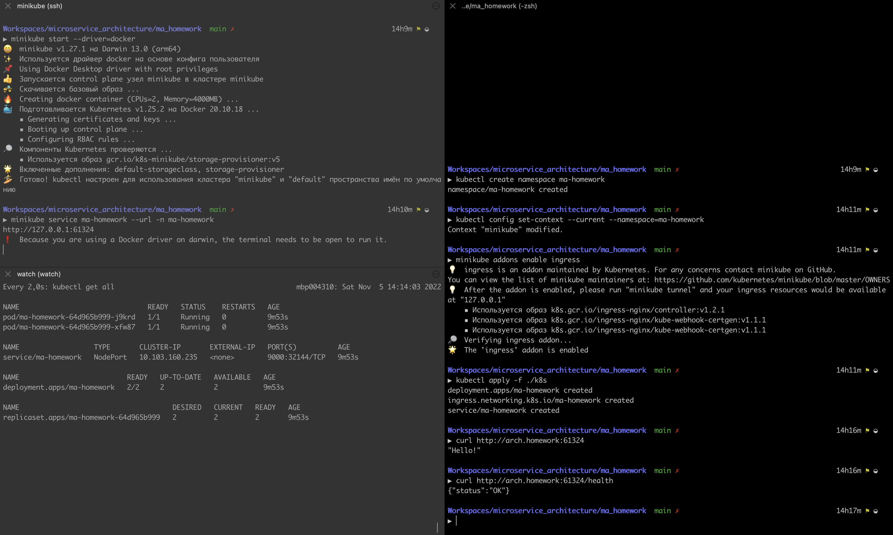

# Результат выполнения домашнего задания

Скриншот с результатом всех описанных ниже операций:



## Последовательность действий

Запускаем minikube:

```bash
minikube start --driver=docker
```

Создаём namespace:

```bash
kubectl create namespace ma-homework
```

Делаем созданный namespace дефолтным:

```bash
kubectl config set-context --current --namespace=ma-homework
```

Активируем плагин для ingress.

```bash
minikube addons enable ingress
```

Применяем манифесты:

```bash
kubectl apply -f ./k8s
```

Смотрим локальный ip у сервиса (для M1 другого варианта, кажется, нет) и берём отсюда порт:

```bash
minikube service ma-homework --url -n ma-homework
```

Добавляем в /etc/hosts строку:

```
127.0.0.1 arch.homework
```

Тестируем при помощи утилиты `curl`, предварительно указав скопированный ранее порт:

```bash
curl http://arch.homework:<port>
```